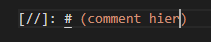

# Markdown
Het maken van mijn eerste markdown

## Key-terms
WYSIWYM - **What You See Is What You Mean**. zijn softwares die voornamelijk gefocussed zijn op de onderliggende structuur van de content die je maakt ipv van de opmaak. Zoals HTML en Markdown

WYSIWYG - **What You See Is What You Get**. zijn applicaties die gefocussed zijn voor mensen die content willen maken dat gelijk representatief is op het eindproduct. Zoals word, canva of wordpress

Comments command zelf geleerd Bijv:  
## Opdracht

### Gebruikte bronnen
[WYSIWYM VS WYSIWYG](https://docs.zettlr.com/en/concepts/wysiwym/#:~:text=The%20guiding%20principle%20for%20WYSIWYG,see%20is%20what%20you%20mean)

[Codeblockinfo](https://docs.github.com/en/get-started/writing-on-github/working-with-advanced-formatting/creating-and-highlighting-code-blocks)

### Ervaren problemen
Het maken van een codeblok was een klein probleem. maar na een beetje googlen kwam ik er achter dat je gewoon drie ``` nodig hebt

[//]: # (leg eventjes uit wat het was) 

### Resultaat
Mijn hele markdown file staat in mijn repository met de genoemde benodigdheden.
  - Level 1 header door # bij het begin van een paraaf te zetten
  - Level 2 header ## bij het begin van een paraaf te zetten
  - Codeblok  door de code in te sluiten met drie tickjes ```
  - en een link maken met: ```[title](link)```

[//]: # (comment hier)